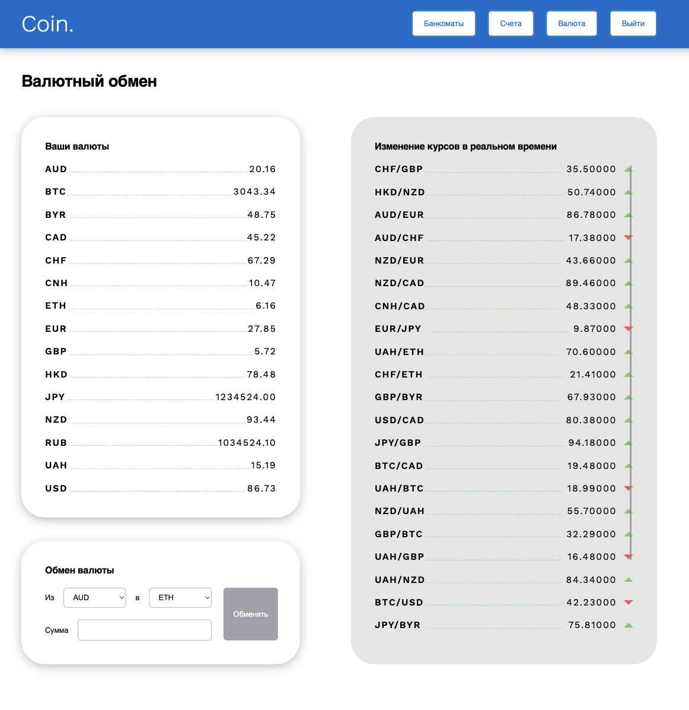

### Coin.

# Техническое задание
Необходимо разработать банковскую систему хранения и операций над криптовалютными средствами.

Основной функционал приложения:
- Авторизация
- Управление счетами пользователя: создание нового счёта, отображение списка счетов, отображение баланса, просмотр истории транзакций
- Переводы на счета или карты других пользователей
- Возможность производить валютные обмены
- Отображение банкоматов на карте
I
Веб-приложение имеет следующие разделы:

- Форма входа пользователя

- Список счетов пользователя

- Просмотр информации о существующей карте
- Форма для перевода средств
- Подробная история баланса по карте

- Мониторинг курса валют и валютные переводы

- Страница отображения точек банкоматов на карте

---
Инструкция по запуску сервера находится в папке "backend"
---
В проекте присутствовуют end-to-end-тесты на базовый функционал приложения: возможность авторизоваться, возможность просмотреть список счетов, возможность перевести сумму со счёта на счёт, возможность создать новый счёт и перевести с него сумму тоже.

Запуск тестов: 
- Переходим в папку "frondent"
- Выполняем команду `npm i` для установки и `npx open cypress` для запуска e2e тестов.  
